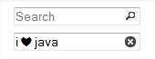

# jquery-inputsearch.js

[](https://www.npmjs.com/package/jquery-inputsearch)
[](http://npm-stat.com/charts.html?package=jquery-inputsearch)
[](https://raw.githubusercontent.com/dwiyatci/jquery-inputsearch/master/LICENSE.txt)

jQuery plugin for automagically transforming `input[type="text"]` elements into 
`input[type="search"]`-like elements.



I started to write this plugin back in 2013, contending other solutions to this 
[issue](http://stackoverflow.com/questions/6258521) in SO, right before I did 
some crazy [CouchSurfing](https://couchsurfing.com) to Stockholm, Sweden.

### Why?
There are a couple of highly upvoted answers in that thread (with some jQuery 
plugins written corresponds to them), but I was interested in writing my own 
because none of them uses [jQuery UI icons](https://api.jqueryui.com/theming/icons).

Things have pretty much changed (annually) since then. :bowtie:

Now, the plugin is:

- lightweight (~4 KB),
- straight-forward; not requiring any CSS or images files to be 
included,
- minimalist and consistent because it uses Base64-encoded `search` and 
`circle-close (cross)` icons of jQuery UI.

## Demo
You can see the plugin in action at [JSFiddle](https://jsfiddle.net/glenn/eP7TZ).

## Installation

Install jQuery InputSearch plugin via the command line with npm:

```bash
$ npm isntall jquery-inputsearch
```

Or simply by downloading it [here](https://unpkg.com/jquery-inputsearch@latest).

Add the script to your page after adding jQuery:

```html
<script src="//code.jquery.com/jquery-latest.js"></script>
<script src="PATH/TO/jquery.inputsearch.js"></script>
```

## Usage

### Basic example

```javascript
$('input').inputSearch();
```

### Options

#### searchIconVisible (default: `true`)

Type: `Boolean`

A boolean value to determine whether the search icon should be visible or not.

#### onClear (default: `$.noop`)

Type: `Function`

An event callback handler when the clear icon is clicked.

```javascript
$('input').inputSearch({
  onClear() {
    // Life, Universe, and Everything
    console.log('number 42');
  }
});
```

## Author
Glenn Dwiyatcita ([@dwiyatci](http://tiny.cc/dwiyatci))

## License
WTFPL – Do What the Fuck You Want to Public License.

See [LICENSE.txt](https://raw.github.com/dwiyatci/jquery-inputsearch/master/LICENSE.txt). 


